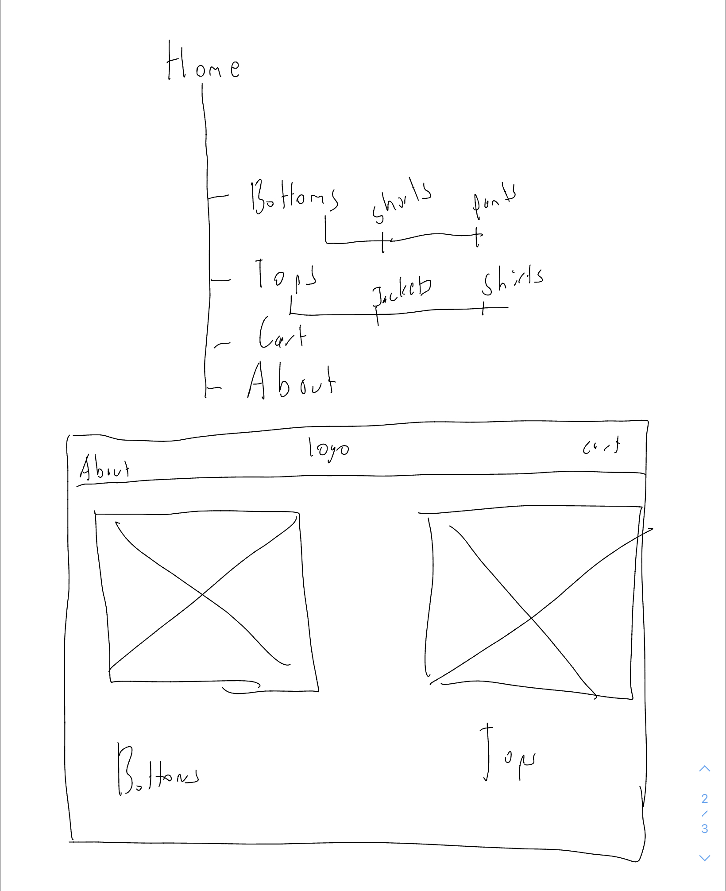

# Supplement

### Intial Outline/Sitemap

Below is the intial sitemap I had for the website. I mostly stuck to this format.

### Design Process and Goal

I had a very preliminary design process. Unfortunately due to limited time, I was not able to fully design all the pages out, but I had a rough idea of how I wanted them to look. I sketched out the sitemap and home page in Notability and used that as my guide as I coded up the website.

My goal was to make a minimalistic website that would contain all the information a user needed to shop for the 5 selections the company had to offer. Using this guideline, I split the website into different parts for Tops and Bottoms and worked from there.

I wanted the images to be the star of the site so I used minimal distracting details. I added hover effects on the images to blur the image to reveal text, and add a drop shadown so it was clear what was being highlighted.

My design process was admittedly not as iterative as it could have been. Once I came up with a design in my head, I did minimal tweaking besides some styling here and there. The layout stayed mostly consistent from what I had in mind. Had I had more time (and started earlier) I would have wanted to create multiple versions so I could show the client and get feedback on every step of the way.

As I mentioned, my goal was to create a minimalistic website that still conveyed the information needed about the company and its products. There are pages for about the company and a cart which is not functional, but with some tweaking could become functional in the short run. I incorporated the colors given to me, and tried to find the closest font available on google fonts to the companys logo (Arpona was not available to me to use on the site so I found Roboto-slab which I think looks very similar).

### Software Used

I took this deliverable as a learning exercise for me. I am very comfortable with vanilla HTML/CSS/JS but I wanted to challenge myself. I was always familiar with ReactJS, but never used it to code a fully fledged website before. To this end, I took the opportunity to learn as much as I can given the time constraints about the popular front end web framework: ReactJS. Using my newly found knowledge I coded the website using ReactJS. The styling is accomplished with CSS. From this project, I learnt a lot about React and going forward would be way more comfortable implementing robust interactivity with react beyond just the looks. As a challenge for myself I'm going to rewrite my personal website in ReactJS as the front end, with Node and Express as the backend to act as the server during Thanksgiving break. This will allow me to become even more familiar with React and the popular MERN stack used to develop full stack web applications.

### Other Software

Other software I am familiar with are HTML/CSS/Bootstrap framework/Javascript/PHP/MySQL (for databases). I also know how to use Wix and Wordpress (having managed and added/designed new pages to the WashU Student Technology Services website). I am also very comfortable with Figma and can use it efficiently to prototype designs and get feedback before coding.

For coding, I use VSCode with multiple extensions and preferences tuned to my liking. However, I am also familiar with Sublime Text. Furthermore I am an amateur at making iPhone apps using Swift programming language and XCode but my skills are rapidly increasing.

I am novice with ReactJS, Node.JS, and Express (along with MongoDB), but I hope to become way more comfortable with these languages and frameworks in the coming days as I practice with them over thanksgiving break. I will also learn about Heroku to deploy these web apps.

### Thank You

Thank you for taking the time to review my application and giving me the opportunity to showcase my skills. Regardless of the decision I learned a lot from this process about myself and going to continue learning more going forward.
